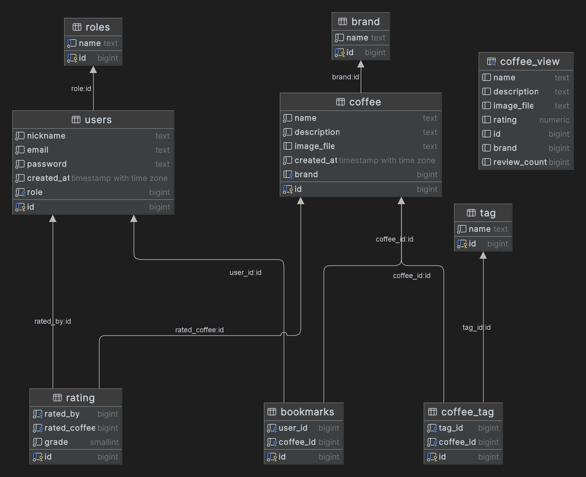

# BrewReview

## Opis

Aplikacja do oceniania kawy. Pozwala na wystawianie użytkownikom ocen w skali 1-5, zapisywanie kaw oraz ich wyszukiwanie. Aplikacja posiada również funkcję dodawania nowych kaw do bazy danych przez użytkowników z rangą administratora.

## Funkcjonalności i charakterystyka

* Rejestracja i logowanie użytkowników
* Sesja użytkownika
* Wylogowywanie użytkownika
* Hashowanie haseł w oparciu o Argon2id
* Asynchroniczne wysyłanie ocen, wyszukiwanie i dodawnaie do zapisanych
* Dodawanie nowych kaw do bazy danych przez administratora
* Responsywny design i tryb mobilny

## Użyte technologie

* Php 7.4.3
* nginx 1.17.8
* HTML
* CSS
* JavaScript
* Docker

## Diagram ERD

